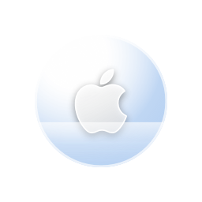

# Apple Music 歌单管家 + 桌面悬浮球

> 一个 **Apple Music 歌单管理工具**，由两部分组成：
> 一个 Edge 扩展（独立的歌单管理小窗口）＋ 一个 Windows 桌面悬浮球（原生 WPF，跟随音乐律动）。
>
> An Apple Music playlist manager: an Edge extension with a standalone panel window,
> plus a native Windows desktop widget that reacts to your music.

<p align="center">
  
</p>

---

## 它能做什么

苹果官方的 Apple Music 网页版**不能批量建歌单、不能方便地增删歌曲**。这个项目补上了这块：

| 功能 | 在哪 |
|---|---|
| 浏览全部歌单、展开看曲目 | 独立面板窗口 |
| 歌单内搜索并添加歌曲 | 独立面板窗口 |
| 从歌单移除歌曲 / 删除歌单 | 独立面板窗口 |
| **批量创建歌单**（贴一份歌名列表，自动搜索、匹配、多版本选择、失败跳过） | 独立面板窗口 |
| 播放歌单 / 单曲 | 独立面板窗口 |
| 播放 / 暂停 / 上一首 / 下一首 | 桌面悬浮球 |
| 悬停看正在播放的曲目 | 桌面悬浮球 |
| **呼吸光环 + 球内液体跟随音乐涌动** | 桌面悬浮球 |

---

## 两个组件

### ① Edge 扩展 —— 歌单管家


- **独立窗口**：`chrome-extension://<id>/panel.html`，用 `--app` 模式打开，没有地址栏和标签栏
- 扩展页面直接调用 Apple Music API，用 `declarativeNetRequest` 把 `Origin` 改写成 `https://music.apple.com` 绕过来源校验
- 凭证（developer token + Music-User-Token）从网页的请求头里抓取，经 `bridge.js` 中继到后台 Service Worker

### ② 桌面悬浮球 —— 原生 WPF

<p align="center">
  
</p>

- **真透明、真无边框、永远置顶**（`AllowsTransparency` + `Topmost`）
- 走 **Windows 系统媒体会话**（GSMTC）读播放状态，浏览器和客户端都认
- **呼吸光环**：`IAudioMeterInformation` 读指定进程的实时音频电平（不是录系统声音，只读电平表）
- **球内液体**：把音量历史按延迟铺开成波形，水面随音律涌动
- 零依赖：只用 Windows 自带的 PowerShell 5.1 + WPF

---

## 架构

```
┌──────────────────────────────────────────────────────────┐
│  ① 桌面悬浮球  AppleMusicBall.exe                         │
│     原生 WPF · 真透明 · 置顶                              │
│     左键 播放/暂停   中键 打开歌单面板                     │
│     右键 菜单（含唯一的颜色入口）                          │
└───────────────────────┬──────────────────────────────────┘
                        │  msedge --app（不占标签页）
┌───────────────────────▼──────────────────────────────────┐
│  ② 歌单面板  Edge app 窗口 · 无地址栏                      │
│     浏览 / 增删 / 创建歌单                                │
│     播放 → 转发给网页执行                                 │
└───────────────────────┬──────────────────────────────────┘
                        │  background ↔ bridge 三通道转发
┌───────────────────────▼──────────────────────────────────┐
│  ③ music.apple.com  零 UI                                 │
│     抓取登录凭证（唯一来源）                               │
│     用 MusicKit 执行真正的播放                            │
└──────────────────────────────────────────────────────────┘
```

**为什么播放要绕回网页？** 因为 `window.MusicKit` 只存在于页面里。面板窗口没有它，
所以播放指令走 `面板 → 后台 → bridge.js → 页面 → MusicKit`。这是这套架构的固有限制，
也是唯一可行解。

---

## 快速开始

### 前置条件

| 组件 | 要求 |
|---|---|
| Edge 扩展 | Microsoft Edge **111+**（需要 `world: "MAIN"` 的 content script） |
| 桌面悬浮球 | Windows 10 2004+ / Windows 11，**无需安装任何东西** |

### ① 安装扩展

1. 打开 `edge://extensions`
2. 打开右上角的 **开发人员模式**
3. 点 **加载解压缩的扩展** → 选择 `extension/` 目录
4. 记下扩展的 **ID**（形如 `gnkgbjakjmedbebcelkfkcijjbpeiljh`）

> ⚠️ **不要移动 `extension/` 目录** —— 解压缩扩展的 ID 由目录路径推导，移动后 ID 会变。

### ② 启动桌面悬浮球

```powershell
cd desktop-ball
powershell -NoProfile -ExecutionPolicy Bypass -File "安装快捷方式.bat"
```

双击运行一次，会在**桌面**和**开始菜单**创建快捷方式。之后双击图标即可启动。

> `AppleMusicBall.exe` 是预编译的启动器，图标已嵌入。
> 想自己编译见 [重新编译启动器](#重新编译启动器)。

### ③ 让它工作起来

扩展需要一个**已登录的 music.apple.com 页面**来抓取凭证：

1. 打开并登录 `music.apple.com`
2. 随便播放一首歌 → 凭证被抓取并中继到后台
3. 中键点桌面悬浮球 → 歌单面板弹出

> 浏览器重启后凭证会失效，重新打开一次 Apple Music 页面即可。

---

## 配置

桌面悬浮球的所有参数都在 `desktop-ball/ball.ps1` 顶部：

```powershell
$BallSize     = 128      # 窗口尺寸（比球体大，给呼吸光环留扩散空间）
$GlassCore    = 84       # 玻璃球直径
$AppleSize    = 40       # 苹果标尺寸
$MeterMs      = 70       # 呼吸/液体的采样间隔（帧率）

$RimGlowWidth = 5.5      # 呼吸光环粗细
$RimGlowBlur  = 11       # 呼吸光环柔化半径
```

球内液体的参数在 `Update-Wave` 函数里：

```powershell
$fill = 0.34 + 0.10 * $script:BreathLevel   # 水位（0.34 = 占球体下半 34%）
$amp  = $w * 0.26                            # 水面起伏幅度
$script:WaveBars   = 12                      # 水面【流多快】（越短越快）
$script:WavePoints = 40                      # 水面【多平滑】（越多越顺）
```

### 性能

| 状态 | CPU | 内存 |
|---|---|---|
| 挂机（不播放，球完全静止） | ~0.9% | ~190 MB |
| 播放中（液体在涌动） | ~3.7% | ~190 MB |

**帧率是唯一的杠杆。** WPF 的透明窗口每帧重绘约 1.8ms 是架构固定成本，
`$MeterMs` 越小越顺、CPU 越高：

| `$MeterMs` | 帧率 | CPU |
|---|---|---|
| 50 | 20 fps | ~5% |
| **70（默认）** | **14 fps** | **~3.7%** |
| 130 | 7.7 fps | ~2.8% |

**安静时球完全静止**（不重绘），所以挂机几乎不耗电。

---

## 几个有意思的技术点

### 绕开 Apple 的来源校验

Apple Music 的 developer token **绑定来源**。扩展页面发出的请求 `Origin` 是
`chrome-extension://...`，会被判 **401**（且响应体为空）。

解法是用 `declarativeNetRequest` 改写请求头：

```javascript
{
  action: {
    type: 'modifyHeaders',
    requestHeaders: [
      { header: 'origin',  operation: 'set', value: 'https://music.apple.com' },
      { header: 'referer', operation: 'set', value: 'https://music.apple.com/' }
    ]
  },
  condition: { urlFilter: '||music.apple.com', resourceTypes: ['xmlhttprequest'] }
}
```

### MAIN world ↔ ISOLATED world 桥接

`content.js` 必须跑在 `world: "MAIN"`（为了用 MusicKit），但**MAIN world 没有 `chrome.*` API**。
所以另有一个 `bridge.js` 跑在 ISOLATED world 负责中继，两边用 `window.postMessage` 通信：

```
content.js(MAIN) ──postMessage──▶ bridge.js(ISOLATED) ──chrome.runtime──▶ background.js
```

### 不录声音就能拿到实时电平

不需要 WASAPI 环回采集（那要几百行 COM 互操作），
`IAudioMeterInformation` 挂在**单个音频会话**上就能直接读实时峰值：

```csharp
meter.GetPeakValue(out float peak);   // 0.0 ~ 1.0
```

按进程名过滤会话，就能做到「只跟随 Apple Music」。

### 单值音量 → 流动的波形

只能拿到**一个总音量值**（没有分频段数据）。用**延迟抽样**把它铺成波形：

```
把最近 12 次采样存成环形队列
第 i 个点读【第 i 拍之前】的电平
   ↓
波形就会横向流动，而不是整条一起上下跳
```

再把「流多快」（`WaveBars`）和「多平滑」（`WavePoints`）**解耦**，
中间用插值 + smoothstep 连接 —— 短历史也能画出平滑的水面。

---

## 已知限制

| 限制 | 原因 |
|---|---|
| **播放需要 `music.apple.com` 标签页开着** | `window.MusicKit` 只存在于页面里 |
| **只能跟随「浏览器类应用」的音频，无法区分标签页** | Chromium 把整个浏览器的音频归到一个音频会话，会话显示名为空 |
| **颜色只能球 → 面板，不能反向** | 浏览器扩展无法写任意本地文件，两边没有共享存储 |
| 扩展每次重新加载后需刷新一次页面 | 已注入的 content script 会变成孤儿脚本（3.5.0 起有自动重注入兜底） |
| 桌面球内存约 190 MB | PowerShell 宿主 + .NET Framework + WPF 的固有成本 |

---

## 目录结构

```
apple-music-suite/
├── extension/                Edge 扩展（歌单管家）
│   ├── manifest.json           MV3 清单
│   ├── content.js              面板 UI + API + 播放（页面/窗口双模式共用）
│   ├── bridge.js               MAIN ↔ ISOLATED 桥接（三通道转发）
│   ├── background.js           Service Worker（凭证 / 代理 / 开窗 / 自动重注入）
│   ├── panel.html              独立面板窗口
│   ├── selftest.html / .js     连通性诊断页
│   └── icon128.png
│
├── desktop-ball/             桌面悬浮球（原生 WPF）
│   ├── ball.ps1                球本体
│   ├── audio.cs                音频计量模块（纯 COM 互操作）
│   ├── launcher.cs             启动器源码
│   ├── AppleMusicBall.exe      预编译启动器（图标已嵌入）
│   ├── ball.ico                图标
│   ├── 启动悬浮球.vbs / .bat     启动入口（零闪窗 / 备用）
│   └── 安装快捷方式.bat / .ps1   一键创建桌面快捷方式
│
└── assets/                    README 用的图片
```

---

## 重新编译启动器

`AppleMusicBall.exe` 只是个隐藏窗口启动器，用 Windows 自带的 `csc.exe` 编译：

```powershell
$csc = "$env:SystemRoot\Microsoft.NET\Framework64\v4.0.30319\csc.exe"
& $csc /nologo /target:winexe /out:AppleMusicBall.exe `
       /win32icon:ball.ico /reference:System.Windows.Forms.dll launcher.cs
```

重新生成图标（球会按当前配色渲染）：

```powershell
powershell -NoProfile -ExecutionPolicy Bypass -File ball.ps1 -MakeIcon ball.ico
```

自检（不弹窗，检查 XAML / 换色通路 / 音频计量 / 呼吸通路）：

```powershell
powershell -NoProfile -ExecutionPolicy Bypass -File ball.ps1 -TestOnly
```

---

## 免责声明

本项目仅供**个人学习与自用**。它不是 Apple 官方产品，与 Apple Inc. 无任何关联。
Apple Music 是 Apple Inc. 的商标。

工具只读取和修改**你自己账号里你自己创建的歌单**（Apple 内置歌单会被自动置灰，不允许修改）。
所有数据都在你的账号和浏览器里，**不经过任何第三方服务器**。

---

## License

[MIT](LICENSE)
